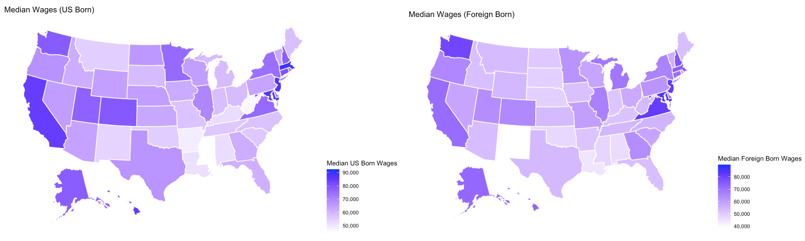

```{r setup, include=FALSE}
knitr::opts_chunk$set(echo = FALSE, message=FALSE, warning=FALSE, error =FALSE)
```


```{r}
library(tidyverse)
library(usmap)
library(gridExtra)
library(knitr)
```


```{r load_data}
link <- 'https://raw.githubusercontent.com/beninbar/DATA-607/main/Final%20project/data/state_immigration_stats.csv'
state_data <- read_csv(link,show_col_types=FALSE)
```

## How do wages for US-born vs foreign born differ based on available data

```{r}
median_wages <- state_data |>
    group_by(state) |>
    summarise(foreign_born_median_wages = mean(foreign_median_wages),
              us_born_median_wages = mean(us_median_wages),
              diff_wages = us_born_median_wages-foreign_born_median_wages)

ggplot(data=median_wages,mapping=aes(x=us_born_median_wages,y=foreign_born_median_wages))+
    geom_point() +
    geom_jitter() +
    geom_text(aes(label=state),color='black',size=4,vjust=1) +
    geom_smooth(method='lm') +
    labs(title= '2019 Median Annual Wages by Birth',subtitle = 'Source: Migration Policy Institute via American Community Survey')
```


## Correlation and T-Test

```{r}
cor(median_wages$us_born_median_wages,median_wages$foreign_born_median_wages)

t.test(median_wages$diff_wages,conf.level = .95)
```


## Map of US - Foreign Wage Difference

```{r}
plot_usmap(
    data = median_wages, values = "diff_wages", color = "white"
  ) + 
  scale_fill_continuous(
    low = "white", high = "blue", name = "Median Wages Difference (2019)", label = scales::comma
  ) + 
  labs(title = "Median Wage Comparison", subtitle = "US - Foreign Wages.") +
  theme(legend.position = "right")
```

## Top/Bottom 5 Wage Differential

```{r}
median_wages |>
    arrange(-diff_wages) |>
    head(5)

median_wages |>
    arrange(-diff_wages) |>
    tail(5)
```


## Differential Map: US vs Foreign Born Median Wages

{width=100%}


## Foreign Workers in Highest Wage Band

```{r}
state_bin <- state_data |> filter(order!=0) |>
    mutate(earning_bin = str_trim(str_replace_all(header,c('Earned'='', ', or incurred a loss'=''))),
           foreign_born_perc = as.numeric(str_replace(foreign_born,'%',''))/100,
           us_born_perc = as.numeric(str_replace(us_born,'%',''))/100)

state_bin |> filter(earning_bin=='$75,000 or more') %>%
    ggplot(aes(reorder(state,foreign_born_perc),foreign_born_perc,fill='blue')) +
    theme(axis.text.x = element_text(angle=90,hjust=0.9),legend.position = 'none') + 
    geom_bar(stat='identity') +
    labs(x='States',y='Foreign Born (%)', title='Percentage of Foreign Born making $75,000+')
    
```

## Number of states in each binned wage range

```{r}
state_bin_top <- state_bin |> 
    group_by(state) |> 
    mutate(top_rank_foreign = rank(-foreign_born_perc),
           top_rank_us=rank(-us_born_perc)) |> 
    pivot_longer(cols=c('top_rank_foreign','top_rank_us'),names_to='measure_name',values_to='measure_values') |>
    filter(measure_values==1)    

most_common_bins <- state_bin |> 
    group_by(state) |> 
    mutate(top_rank_foreign = rank(-foreign_born_perc),
           top_rank_us=rank(-us_born_perc)) |> 
    pivot_longer(cols=c('top_rank_foreign','top_rank_us'),names_to='measure_name',values_to='measure_values') |>
    filter(measure_values==1) %>%
    
    group_by(earning_bin,measure_name) |>
    summarise(count = n()) %>%
    ggplot(aes(earning_bin,count,fill=measure_name)) +
    geom_bar(stat='identity',position='dodge') +
    theme(axis.text.x = element_text(angle=90,hjust=0.9))+
    labs(x='Earnings Bin',y='State Count', title='Highest Frequency Wage Bins')
most_common_bins + scale_fill_discrete(name="Category",labels=c('Most Common Foreign Born','Most Common US Born'))

```


## Where is the disparity occuring?

```{r}

bin_diff <- state_bin_top  %>%
    group_by(state) |> 
    select(state,measure_name,order) |>
    pivot_wider(names_from=measure_name,values_from=order) |>
    mutate(top_rank = top_rank_us - top_rank_foreign)
    
plot_usmap( data = bin_diff, values = "top_rank", color = "white" ) + 
  scale_fill_continuous(
    low = "white", high = "blue", name = "Differential between US born versus foreign born wages", label = scales::comma
  ) + 
  labs(title = "Bin Difference (US - Foreign)",subtitle='Differential Strength (positive values:US>Foreign; negative: Foreign>US)') +
  theme(legend.position = "right")

```


